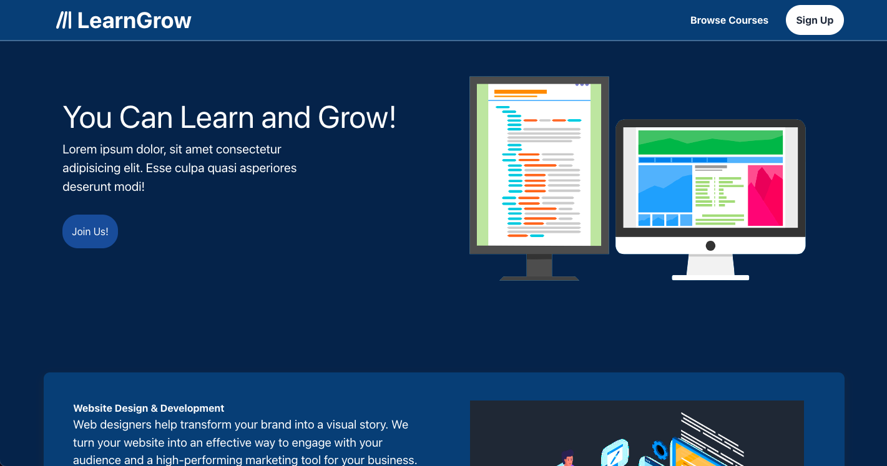

<p align="center">
    
</p>
<h1 align="center">
  Interactive Learning Webapp
</h1>

<p align="center">
      
</p>

<p align="center">

</p>
<p align="center">
    <a href="https://memberpress.com/wp-content/uploads/2020/12/coming-soon-page.jpg" target="blank">View Demo</a>
    ·
    <a href="https://github.com/OmarMHawash/userpanel/issues/new">Report Bug</a>
    ·
    <a href="https://github.com/OmarMHawash/userpanel/issues/new">Request Feature</a>
</p>


#### Welcome to our interactive learning platform!
Here you can easily customize your learning experience, track your progress, and expand your knowledge and skills. Start your journey of discovery and growth today!


<h2 id="demo"> 🚀 Demo </h2>


Checkout The Demo: [Live Demo](https://memberpress.com/wp-content/uploads/2020/12/coming-soon-page.jpg)


<h2 id="markdown-navigation"> 🧭 Markdown Navigation </h2>

- [Markdown Navigation](#markdown-navigation)
    - [Quick Start](#quick-start)
    - [Features](#features)
    - [Resources](#resources)
    - [Preview](#preview)
    - [What's New?](#changes)


<h2 id="quick-start">🛠️ Installation Steps </h2>

### *pre-requisites
you will need to have **Node.js** installed on your computer and **Git** (or you can download as a **zip file**)

## Steps
1. Clone the repository

```bash
git clone https://github.com/OmarMHawash/userpanel.git
```

2. Change the working directory

```bash
cd userpanel
```

3. Install dependencies

```bash
npm install
```

4. Run the app

```bash
npm start
```

<h2 id="features">🤯 Features & Functionalities </h2>

- User login and registration with authentication.
- Simple Homepage navigation and straightforward design for user experience
- Rich and playfull User Panel for interactive learning experience and progress tracking (in progress...)
- Browse Courses and Filteration that fits different intrests and levels of experience (in progress...)
...

<h2 id="resources">💻 Technologies Used </h2>

- This project was bootstrapped with [Create React App](https://github.com/facebook/create-react-app).
- Used [Google Firebase](https://firebase.google.com) tools to handle user authentication and data manipulation.

<h2 id="preview">🌁 Project showdown </h2>

### Home Page


### Courses Browse


## Course Details


## User Registeration


## Dashboard


<h2 id="changes"> 🆕 What's New </h2>

### Latest Features
- ...


### Changelog
- ...
- ...
